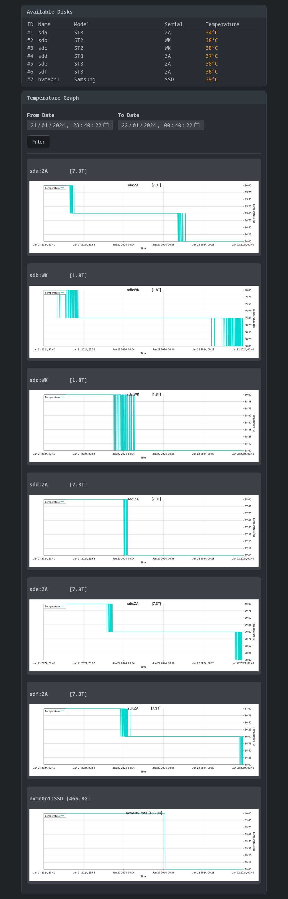

## 📖About

Drive Health is a program written in golang to help with tracking and monitoring of your hardware's temperature.

This tool has been created by [me](https://danlegt.com) with the purpose of installing it in different servers I own with different configurations to help keep track of the temperature of different hard-disks, ssds, nvme drives, etc... The testing has been very limited to only 4 different computers and not on laptops so expect some mishaps.



## ❗Disclaimer

I'm not exactly a linux hardware wizard, so I honestly have no clue about a lot of things and I myself can tell there's a lot to improve upon and that there's a lot of other things missing that are a little bit more obscure, I personally don't currently own any m.2 sata drives to test the code on, or many of the other drive types, I have only tested on HDD, SSD and NVMe drives, any issues opened would help me so much!

## ❗Requirements
1. A linux machine, this will NOT work on macOS or on Windows, it's meant to be ran on servers as a service with which administrators can privately connect to for temperature logging.

2. Please make sure you have the [**drivetemp kernel drive**](https://docs.kernel.org/hwmon/drivetemp.html) you can check this by running `sudo modprobe drivetemp`.
The program depends on this to be able to log the temperature of your devices.


## 📖How to use

The program is straight forward to use really, edit the [.env](./.env) file and make the changes you would like applied.

### Docker ( Recommended/Hassle free )

### SystemD
```ini
[Unit]
Description=Drive Health Service
After=network.target

[Service]
Type=simple
User=daniel # Your user here
WorkingDirectory=/home/daniel/services/drive-health # The path to the service's directory
ExecStart=/home/daniel/services/drive-health/drive-health # The path to the binary
Restart=on-failure

[Install]
WantedBy=multi-user.target
```

## ❔FAQ

### How does it work?
Currently the program does not depend on any hardware library as I couldn't find anything that would not require root access while giving me the possibility to interrogate the temperature of the drives, I chose not to depend on `lsblk` either, so how does the program work? Well it looks in `/sys/block` and simply

### Why not just run as root?
I really, really, **really** want to avoid asking people to run **ANY** program I write as root and even try and prevent that from happening since that's how things can go bad, especially because I am runnig actions over hardware items. I think you can see how easy it is for a mistake or a **malicious attack** to easily deal damage

## Support & Contribution

For support, bug reports, or feature requests, please open an issue on the [GitHub repository](https://github.com/JustKato/drive-health/issues). Contributions are welcome! Fork the repository, make your changes, and submit a pull request.

## License

This project is licensed under the [Apache License 2.0](./LICENSE).